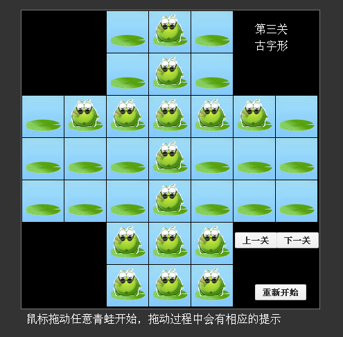

# xinglie game

>独立钻石起源于法国，是一种风靡世界的益智游戏与中国发明的“华容道”、匈牙利人发明的“魔方”， 并称为“智力游戏界的三大不可思议”
>它类似于跳棋，但不能走步，只能跳。走棋时棋子跳过相邻的棋子到空位上，并把跳过的棋子吃掉。棋子可以沿棋盘的格线横跳、纵跳，但不能斜跳

[了解更多](http://baike.baidu.com/link?url=Y89UVVwKi6EoiGnuYAGVH78PV5NjcJVtJL4wALCqbEUr67Hyq89LeX9bnCHFWd5zNFYAM6qESkMkhJj6Qrg4kq)

## 关于游戏制作
这是在武汉(2008年)做雕刻工的时候闲暇时候写的，当时雕刻用的电脑不让联网，也就没有什么游戏可玩。为了消磨时间，就想起了初中(2001年)读过的这个单人游戏，所以就写了一个网页版本的自己玩。当时前端技术知识浅薄，不会写拖动的，只写成了点击开始棋子闪烁，再点击目标位置，判断是否可以落棋。当时就是普通的棋子

2011年北漂的时候前端知识还算可以，重构了一次。改成了青蛙的外观，改成了拖动

2016年使用[Magix](https://github.com/thx/magix)重构。
